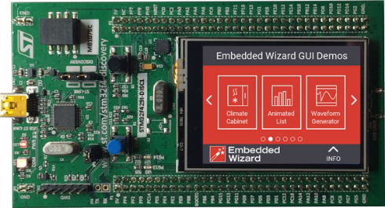
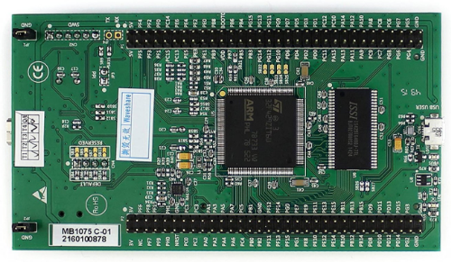
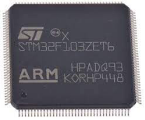
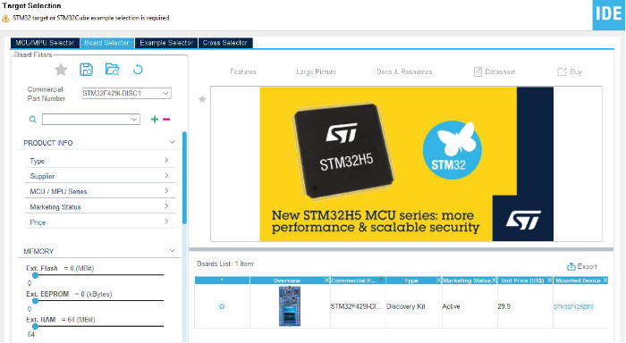
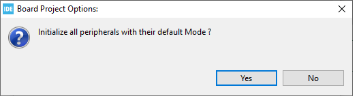
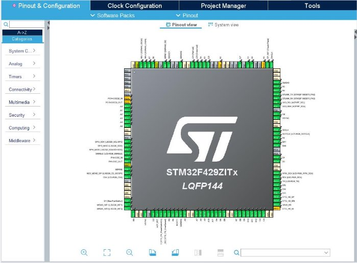
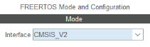
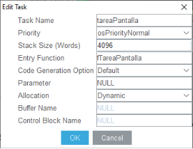
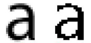
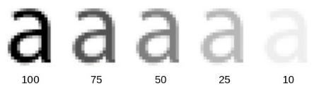

# 🚀 STM32F429I-DISC1-LCD

_Practica 1_ de la asignatura **'Sistemas de control a tiempo real'** de **Ingenería en electrónica industrial y automática** de la **Universidad de Vigo {Uvigo}** curso 24-25

## 📚 Enunciado de la práctica

En esta práctica elaboraremos código en lenguaje C para manejo de una pantalla táctil en una placa [STM32F429I-DISC1](https://www.st.com/en/evaluation-tools/32f429idiscovery.html)





La placa [STM32F492I-DISC1](https://www.st.com/en/evaluation-tools/32f429idiscovery.html) dispone de:



- Un microcontrolador [STM32F429ZIT6](https://www.st.com/en/microcontrollers-microprocessors/stm32f429zi.html) de 32 bits con:

  - núcleo [ARM Cortex-M4](https://developer.arm.com/ip-products/processors/cortex-m/cortex-m4) con unidad FPU de cálculo en punto flotante
  - reloj de hasta 180 MHz
  - 2 MiBytes de memoria Flash
  - 256 KiBytes de memoria RAM
  - interfaz con pantallas LCD
  - acelerador gráfico Chrom-ART para transferencias con una pantalla independientes de la CPU
  - hasta 3 ADCs de 12 bits para 16 entradas analógicas y 2 DAC de 12 bits
  - hasta 17 temporizadores con interfaz para encóders incrementales
  - interfaces [SWD](https://wiki.segger.com/SWD) y [JTAG](https://es.wikipedia.org/wiki/JTAG) para depuración de aplicaciones
  - hasta 168 E/S digitales con capacidad de interrupción
  - hasta 21 canales de comunicación [I2C](https://es.wikipedia.org/wiki/I%C2%B2C), [SPI](https://es.wikipedia.org/wiki/Serial_Peripheral_Interface), [USART](https://en.wikipedia.org/wiki/Universal_asynchronous_receiver-transmitter), [CAN](https://es.wikipedia.org/wiki/Bus_CAN), [SAI](https://www.st.com/content/ccc/resource/training/technical/product_training/0c/16/3b/b4/76/8a/47/51/STM32L4_Peripheral_SAI.pdf/files/STM32L4_Peripheral_SAI.pdf/jcr:content/translations/en.STM32L4_Peripheral_SAI.pdf), [SDIO](https://en.wikipedia.org/wiki/SD_card#SDIO_cards).
  - controlador [USB 2.0](https://es.wikipedia.org/wiki/Universal_Serial_Bus) para actuar como host o cliente
  - controlador Ethernet 100 Mbit/s
  - interfaz paralela de 8 a 14 bits con cámara, hasta 54 Mbytes/s

- una RAM externa de 8 MiBytes
- otro microcontrolador de 32 bits para implantar un depurador hardware en tiempo real con interfaz ST- LINK con conexión USB para descarga y depuración de aplicaciones, puerto serie virtual y almacenamiento de sistema de archivos
- pantalla LCD TFT táctil resistiva de 2.4" resolución QVGA de 240x320 puntos con controlador [ILI9341](https://cdn-shop.adafruit.com/datasheets/ILI9341.pdf)
- giróscopo 3D [I3G4250D](https://www.st.com/en/mems-and-sensors/i3g4250d.html)
- alimentación a través de la conexión USB de la interfaz ST-LINK o mediante fuente externa de 5V

Sistema de desarrollo [STM32CubeIDE](https://www.st.com/en/development-tools/stm32cubeide.html):

- Programación de aplicaciones para la familia de microcontroladores [STM32](https://www.st.com/en/microcontrollers-microprocessors/stm32-32-bit-arm-cortex-mcus.html) de la firma [STMicroelectronics](https://www.st.com/content/st_com/en.html) con núcleo [Cortex ARM](https://www.arm.com/products/silicon-ip-cpu).
- Sistema de desarrollo gratuito disponible para Windows, Linux y Mac OS.
- Programación en lenguajes C y C++.
- IDE (_Integrated Development Environment_) basado en [Eclipse CDT](https://www.eclipse.org/cdt/) (_C/C++ Development Tooling_).
- Interfaz gráfica para configuración inicial del microcontrolador y generación automática de código.
- Herramientas para análisis de memoria, periféricos y CPU durante la ejecución de aplicaciones.

Paquete de herramientas [STM32CubeF4](https://www.st.com/en/embedded-software/stm32cubef4.html) para la programación de aplicaciones en microcontroladores de 32 bits de la familia STM32F4. Contiene:

- STM32F4 HAL (_Hardware Abstraction Layer_) con una API (_Application Programming Interface_) en lenguaje C en forma de macros, variables, tipos de dato, funciones, etc. comunes para múltiples familias de microcontroladores para una mayor portabilidad del código.
- STM32F4 LL (_Low Layer_) API para la programación a bajo nivel del manejo de los periféricos de cada modelo de microcontrolador, con un código más optimizado pero requiriendo un conocimiento más profundo del hardware.
- Un conjunto de bibliotecas de funciones a más alto nivel para manejo de comunicaciones USB, TCP/IP, etc y para poder disponer de un RTOS (_Real-Time Operating System_).
- Documentación: [STM32F4 HAL and low-layer drivers](https://www.st.com/resource/en/user_manual/dm00105879-description-of-stm32f4-hal-and-ll-drivers-stmicroelectronics.pdf)

Creación de un nuevo proyecto en ST32CubeIDE: en menú _`File - New - STM32 Project`_

En la ventana _`Target Selection`_ hay que indicar para qué microcontrolador o placa se va a preparar la aplicación. En la pestaña _`Board Selector`_ indicaremos **STM32F429I-DISC1** en la casilla _`Commercial Part Number`_ y seleccionaremos esta placa abajo a la derecha.



Pulsando en _Next_ podemos indicar el nombre del proyecto, el directorio donde se va a almacenar y el lenguaje de programación utilizado. En la siguiente ventana pulsaremos _Yes_ para que se genere automáticamente código de inicialización de todos los periféricos disponibles en la placa.



Haciendo doble click sobre el archivo con extensión .ioc existente en el proyecto, se abre una herramienta gráfica de configuración del microcontrolador que permite elegir en qué modo va a trabajar cada pin del micro y cada dispositivo interno. Según la configuración elegida, esta herramienta genera automáticamente código en lenguaje C en varios archivos del proyecto que programa la inicialización del micro.



Yendo en el panel de la izquierda por _`Middleware - FREERTOS`_, entramos en la configuración de este sistema operativo en tiempo real.

En `Mode - Interface` eligiremos la opción **CMSIS_V2** para poder utilizar la versión 2 del estándar de programación CMSIS.



En la pestaña _Tasks and Queues_ podemos indicar la creación de una nueva tarea ó hilo de ejecución. Pulsando el botón _Add_, indicamos que:

- el identificador utilizado en el programa para referirnos a esta tarea, por ejemplo tareaPantalla
- se ejecuta con una prioridad normal
- se le asigna una pila y se elige su tamaño, por ejemplo de 4096 words (cada word corresponde a 32 bits)
- esta tarea ejecuta el código de la función **fTareaPantalla()**
- seguidamente se indican opciones para la generación automática de código, entre las que se indica que se crea una estructura de datos para el manejo de esta tarera, que se reserva dinámicamente.



Para generar automáticamente el código de inicialización del microcontrolador y del sistema operativo hay que pulsar el icono y para compilar la aplicación hay que pulsar en el icono en forma de martillo  de la barra de iconos superior o bien hay que elegir la opción de menú _Project - Build project_.

Se genera el archivo `Core/Startup/startup_stm32f429zitx.s` escrito en el lenguaje ensamblador del micocontrolador, donde se realizan llamadas a funciones de inicialización del micro y que llama a la función main() de nuestro programa:

```c
/* Call the clock system intitialization function.*/
bl SystemInit
/* Call static constructors */
bl __libc_init_array
/* Call the application's entry point.*/
bl main
```

En el directorio `Drivers/STM32F4xx*HAL_Driver` se encuentra el código de la capa HAL (_Hardware Abstraction Layer_) para microcontroladores de la familia STM32F4. Define estructuras de datos y funciones comunes para varios modelos de microcontroladores de la firma ST Microelectronics.

En el directorio `Middlewares/ST/STM32_USB_Host_Library` y en el directorio USB_HOST se encuentra código para implantar una interfaz USB Host con dispositivos externos.

En el directorio `Middlewares/Third_Party/FreeRTOS` se encuentra el código del sistema operativo en tiempo real [FreeRTOS](https://www.freertos.org/), utilizado para crear varias tareas ó hilos.

En `Middlewares/Third_Party/FreeRTOS/Source/CMSIS_RTOS_V2` se encuentran los recursos de programación que implantan el estándar [CMSIS](https://www.arm.com/technologies/cmsis) (_Common Microcontroller Software Interface Standard_) para microcontroladores con núcleo ARM. Utilizando este estándar, múltiples modelos de microcontroladores de diferentes fabricantes utilizando diferentes sistemas operativos se pueden programar de la misma forma, aumentando la portabilidad de las aplicaciones.

En el directorio `Drivers/CMSIS` se definen macros para la utilización de periféricos del microcontrolador según el estándar CMSIS.

En `Core/Inc/FreeRTOSConfig.h` se definen macros con ciertos valores para activar o desactivar determinadas funcionalidades del sistema operativo FreeRTOS y para asignar recursos para ese sistema.

En `Core/Src/freertos.c` existen funciones que se ejecutan cuando surge algún problema en la ejecución del sistema operativo FreeRTOS y donde el programador puede añadir código en zonas delimitadas con macros, por ejemplo:

```c
/* USER CODE BEGIN 4 */
__weak void vApplicationStackOverflowHook(xTaskHandle xTask, signed char *pcTaskName)
{
/* Run time stack overflow checking is performed if
configCHECK_FOR_STACK_OVERFLOW is defined to 1 or 2. This hook function is
called if a stack overflow is detected. */
}
/* USER CODE END 4 */
```

Cuando se compila un proyecto, se generan automáticamente los archivos Core/Inc/main.h y Core/Src/main.c para el programa principal donde aparecen secciones enmarcadas entre comentarios como

```c
/* USER CODE BEGIN Includes */
/* USER CODE END Includes */
```

para que el programador añada código sólamente en esas secciones y con el cometido indicado en los comentarios. Cuando se realiza alguna modificación en la configuración del proyecto, estos archivos se generan de nuevo de forma automática y en ese proceso sólo se mantiene el código incluido entre esos comentarios.

En el directorio `Core` el programador puede añadir archivos de declaraciones con extensión **.h** en `Core/Inc` y archivos fuente con extensión **.c** en `Core/Src`.

Junto a este enunciado se proporciona un archivo **ficheros.zip** con los siguientes archivos que hay añadir

al proyecto:

- io.h, ts.h y lcd.h: definición de tipos de datos y enumerados para E/S digital y manejo de la pantalla y

su interfaz táctil.

- **stm32f429i_discovery.h** y **stm32f429i_discovery.c**: macros, enumerados y funciones para de varios recursos en la placa: LEDs, pulsadores, EEPROM. También macros para indicar en qué pines del microcontrolador se encuentran las líneas de canales de comunicaciones I2C, SPI, con la pantalla LCD y con el giróscopo.
- **stm32f429i_discovery_io.h** y **stm32f429i_discovery_io.c**: tipos de datos, enumerados y funciones para E/S digital.
- **stm32f429i_discovery_lcd.h** y **stm32f429i_discovery_lcd.c**: tipos de datos, enumerados y funciones para manejo de la pantalla.
- **stm32f429i_discovery_ts.h** y **stm32f429i_discovery_ts.c**: tipos de datos, enumerados y funciones para manejo de la interfaz táctil resistiva de la pantalla.
- **stm32f429i_discovery_sdram.h** y **stm32f429i_discovery_sdram.c**: tipos de datos, enumerados y funciones para manejo de un chip de memoria RAM estática externo presente en la placa.
- **ili9341.h** e **ili9341.c**: para la comunicación con el chip ILI9341[ que controla](https://cdn-shop.adafruit.com/datasheets/ILI9341.pdf) la pantalla de cristal líquido presente en la placa.
- **stmpe811.h** y **stmpe811.c**: recursos para la comunicación con el chip ST [STMPE811 que ](https://www.st.com/en/touch-and-display-controllers/stmpe812.html)es el controlador de la interfaz táctil de la pantalla.

- **juegoAlphaxx.h** y **juegoAlphaxx.c**, con xx = 13, 15, 17, 19 y 22: definición de juegos de caracteres para mostrar texto en la pantalla, desde caracteres de 13 puntos de alto hasta 22 puntos de alto. Para cada juego se define una matriz de bytes para indicar cómo se visualizan los caracteres de la tabla ASCII desde el código 32 hasta el 126 y caracteres adicionales, como vocales acentuadas y eñes. En los bytes que describen cada caracter se indica la componente Alpha de cada punto, para poder visualizar caracteres en cualquier color y con suavizado de bordes.

 

- **pantalla.h** y **pantalla.c**: archivos donde se dispone de funciones y estructuras de datos para la inicialización de la pantalla LCD, manejo de la interfaz táctil y dibujado de texto, líneas, círculos, rectángulos e imágenes. En estos archivos programaremos más funcionalidades en esta práctica. En las funciones proporcionadas se pueden dibujar los puntos de imágenes, texto, etc aplicando un factor de transparencia adicional con valor de 0 a 100.



Para poder utilizar imágenes y para poder representarlas en el programa en matrices de bytes, se puede utilizar el conversor online disponible en <https://lvgl.io/tools/imageconverter>

En el formulario en Image file se elige el archivo de imagen que se desea convertir.

En Color format se indicará ARGB8888 para que se genere una matriz en lenguaje C con los colores expresados en formato ARGB en 32 bits.

El microcontrolador utiliza dos frame buffers. Cada uno de ellos corresponde a una zona de memoria de 240 \* 320 \* 4 = 307200 bytes = 300 KiB debido a que en cada uno de ellos se guarda el color de cada punto de la pantalla, de 240 puntos de ancho por 320 puntos de alto, y donde cada punto se representa en 4 bytes en formato ARGB.

En el formato ARGB la componente A es canal _alpha,_ indicado en un byte, que expresa el grado de transparencia, desde 0=transparente hasta 255=opaco. En el frame buffer todos los puntos deberían de ser completamente opacos. Cada componente R, G y B indica con un valor entre 0 y 255 la cantidad de color rojo, verde y azul que se mezclan para establecer un color, cada componente en un byte. De esta forma, el color amarillo opaco se guarda con el valor de 32 bits 0xFFFFFF00, con componentes A=0xFF=255 (opaco), R=0xFF (a tope de rojo), G=0xFF (a tope de verde) y B=0x00 (nada de azul).

Los microcontroladores de la serie STM32F4 utilizan una organización _little-endian_ para datos que ocupan varios bytes en memoria.

En el caso de los 4 bytes utilizados para expresar el color de cada punto en la pantalla, las componentes ARGB se guardan en memoria de forma que el primer byte es la componente B, a continuación la componente G, luego la componente R y finalmente el valor de transparencia Alpha.

De todas formas, cuando se expresa un valor de color en el programa en hexadecimal, por ejemplo 0xFF390DE4, las componentes son A=0xFF, R=0x39, G=0x0D y B=0xE4, luego en memoria se guarda en formato _little-endian_.

sctr.eii.uvigo 2024-2025 Práctica 1 8/8![ref1]

En esta práctica de laboratorio se realizarán las siguientes tareas:

- añade y/o modifica lo necesario para que la pantalla se pueda utilizar en vertical o en horizontal en las cuatro orientaciones posibles.
- añade la posibilidad de mostrar gráficas de señales en pantalla, según las indicaciones del profesor.
- crea un framework gráfico con generación automática de código, según las indicaciones del profesor, para poder programar el uso de la pantalla táctil de la forma más fácil posible.
- prepara la documentación del código en formato doxygen.

[ref1]: resources/Aspose.Words.ba47ec15-f055-4c45-a108-4ca230acc0c5.001.png

## 🏆 Instalación de la libreria en un proyecto

### Tenemos dos formas de importar las carpetas

#### 🔵 Forma 1:

1. Creamos el proyecto en "stm32cubeide" y lo llamamos, por ejemplo, como `Practica1_24-25`
2. Para añadir esta libreria al proyecto `Practica1_24` clonamos el repositorio en la carpeta "Middlewares" -> `Practica1_24/Middlewares/`
3. En la configuracion del proyecto haciendo click derecho en el nombre del proyecto `Properties`
4. Navegamos hasta `Properties/'C/C++ Build'/Settings/'MCU/MPU GCC Compiler'/'Include paths'`
5. Añadimos todas las carpetas de la libreria haciendo click en el icono 
   señalado con la flecha roja


5. Hacemos click en `Workspace...`


6. Buscamos las carpetas y subcarpetas de `Practica1_24/Middlewares/STM32F429I-DISC1-LCD`


‼️ No seleccionar las carpetas `.git`, `ENUNCIADO` y `Documentacion`
⚠️ hacer repetidamente los pasos 5 y 6 hasta terminar de añadir todas las carpetas

Ejemplo video

#### 🔵 Forma 2:

1. Hacemos los pasos 1, 2, 3 y 4 de la `🔵 Forma 1`
2. Copiar y pegar las siguientes lineas en el primer cuadro blanco

```python
"${workspace_loc:/${ProjName}/Middlewares/STM32F429I-DISC1-LCD/interfazLCD/Colores}"
"${workspace_loc:/${ProjName}/Middlewares/STM32F429I-DISC1-LCD/interfazLCD/Componentes}"
"${workspace_loc:/${ProjName}/Middlewares/STM32F429I-DISC1-LCD/interfazLCD/Imagenes}"
"${workspace_loc:/${ProjName}/Middlewares/STM32F429I-DISC1-LCD/pantallaLCD/Componentes}"
"${workspace_loc:/${ProjName}/Middlewares/STM32F429I-DISC1-LCD/pantallaLCD/Imagenes}"
../Core/Inc
"${workspace_loc:/${ProjName}/Middlewares/STM32F429I-DISC1-LCD/pantallaLCD/juegosCaracteres}"
"${workspace_loc:/${ProjName}/Middlewares/STM32F429I-DISC1-LCD/Dependencias/Src}"
"${workspace_loc:/${ProjName}/Middlewares/STM32F429I-DISC1-LCD/pantallaLCD}"
"${workspace_loc:/${ProjName}/Middlewares/STM32F429I-DISC1-LCD/interfazLCD}"
"${workspace_loc:/${ProjName}/Middlewares/STM32F429I-DISC1-LCD/Dependencias}"
"${workspace_loc:/${ProjName}/Middlewares/STM32F429I-DISC1-LCD}"
"${workspace_loc:/${ProjName}/Middlewares/STM32F429I-DISC1-LCD/Dependencias/Inc}"
```
